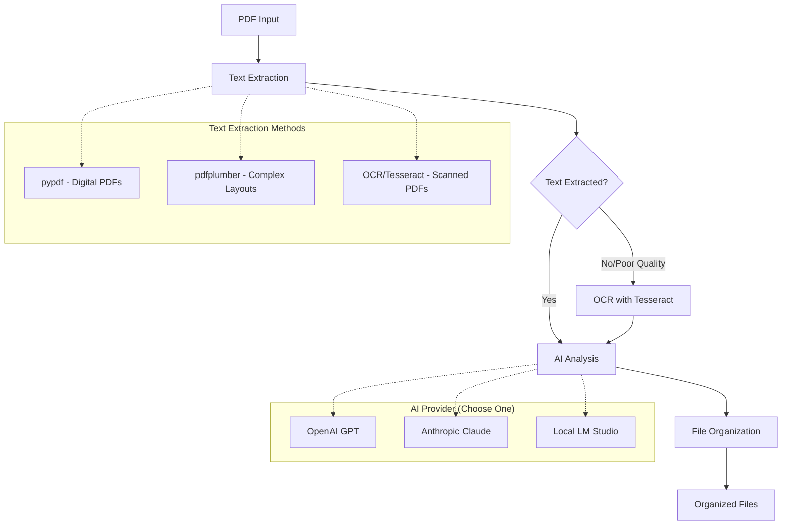

# OCRganizer Documentation

Welcome to the OCRganizer documentation. This comprehensive guide will help you understand, install, configure, and use the system effectively.

## Overview

The OCRganizer is an AI-powered document management system that automatically categorizes, renames, and organizes PDF documents using advanced text extraction and AI analysis.

## Key Features

- **Multi-Provider AI Support**: Works with OpenAI GPT, Anthropic Claude, or local LM Studio
- **Robust Text Extraction**: Handles both digital and scanned PDFs with OCR fallback
- **Intelligent Organization**: Creates structured folder hierarchies
- **Smart Naming**: Generates descriptive filenames
- **Dual Interface**: Web UI and command-line support
- **Privacy-First**: Optional local processing

## Quick Start

```bash
# Clone and setup
git clone https://github.com/yourusername/OCRganizer.git
cd OCRganizer

# Install dependencies
pip install -e .[dev]

# Configure environment
cp env.example env
# Edit env file with your AI provider credentials

# Run the web interface
python app.py
# Visit http://localhost:5000
```

## Architecture



## Documentation

### Getting Started
- [Quick Start](quick-start.md) - Get running in 5 minutes
- [Installation Guide](installation.md) - Complete setup instructions
- [User Guide](user-guide.md) - How to use the system
- [CLI Usage](cli-usage.md) - Command-line interface guide

### AI Providers
- [AI Provider Setup](ai-provider-setup.md) - Detailed setup for OpenAI, Anthropic, and LM Studio
- [Configuration Reference](configuration.md) - Detailed configuration options
- [LM Studio Setup](lm-studio-setup.md) - Local AI setup guide

### Development
- [Developer Guide](developer-guide.md) - Comprehensive developer documentation
- [API Reference](api.md) - Developer API documentation
- [Improvements](improvements.md) - Project improvement history

### Support
- [Troubleshooting](troubleshooting.md) - Common issues and solutions
